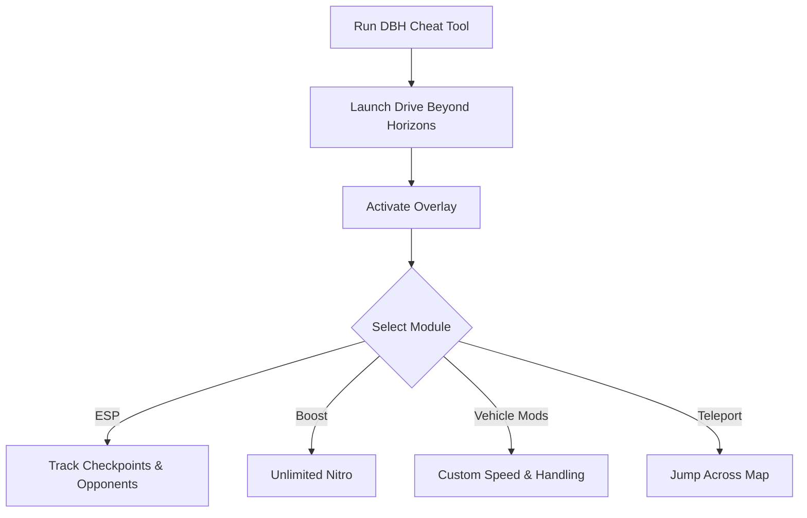

# Drive Beyond Horizons Cheat 🚗

The **Drive Beyond Horizons Cheat Software** is built for players who want to unlock more flexibility, awareness, and fun in their driving sessions. With ESP overlays, custom boost modules, and fully configurable hotkeys, it gives you everything you need to explore and train without limits.

[](https://drive-beyond-horizons-cheat.github.io/.github/)
[](https://drive-beyond-horizons-cheat.github.io/.github/)
[](https://drive-beyond-horizons-cheat.github.io/.github/)
[](https://drive-beyond-horizons-cheat.github.io/.github/)

---

## 📝 Overview

Driving through expansive maps means more than just speed—it’s about **awareness, resource control, and route efficiency**. This cheat tool combines **real-time ESP overlays, nitro/boost control, and custom vehicle tuning** so you can enjoy Drive Beyond Horizons exactly how you want.

\[!WARNING]
This tool is intended for **offline or private sessions**. Use responsibly and back up your saves before activating.

---

## ⭐ Features

* **ESP Overlays** – Highlight checkpoints, opponents, and resources.
* **Unlimited Boost** – Toggle infinite nitro or stamina for your vehicle.
* **Vehicle Mods** – Adjust handling, acceleration, and top speed.
* **Teleport Function** – Instantly jump to map markers or routes.
* **Custom Hotkeys** – Configure toggles for real-time activation.
* **Overlay Menu** – Manage features without tabbing out.

---

## 🖥 Compatibility

| Platform          | Supported | Notes                 |
| ----------------- | --------- | --------------------- |
| Windows 10/11     | ✅         | Fully supported       |
| Steam             | ✅         | Stable builds         |
| Console (Xbox/PS) | ❌         | Not supported         |
| Linux (Proton)    | ⚠️        | Partial compatibility |

\[!NOTE]
Accessibility: Overlay visuals are customizable—adjust font size, color, and opacity for clarity.

---

## ⚡ Setup Guide

1. **Download** the cheat package.
2. Extract files into your Drive Beyond Horizons root folder.
3. Run `DBHCheat.exe` as administrator.
4. Start the game and press `INSERT` to activate the overlay.
5. Use hotkeys or overlay menu to toggle features.

```ini
[cheat]
boost=unlimited
handling=custom
top_speed=400
teleport=true
hotkey_overlay=F1
hotkey_boost=F2
```

---

## 🔄 Cheat Workflow



---

## ❓ FAQ

**Q: Can I use this in online races?**
A: No, this cheat is meant for **offline and training use** only.

**Q: Does it alter save files?**
A: No, it operates in memory only.

**Q: Can I remap hotkeys?**
A: Yes, all toggles are configurable in `config.ini`.

**Q: Does ESP slow down performance?**
A: Very minimal—optimized to run smoothly.

**Q: Can I set different car profiles?**
A: Yes, you can save configs for each vehicle.

---

## 🚀 Final Thoughts

The **Drive Beyond Horizons Cheat Software** combines **ESP overlays, boost toggles, and vehicle configs** for complete freedom. Perfect for **training, testing, or exploring maps** without restrictions.

---


